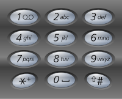

# 17 Letter Combinations of a Phone Number – Medium

### Problem:

Given a digit string, return all possible letter combinations that the number could represent.

A mapping of digit to letters \(just like on the telephone buttons\) is given below.



Input:Digit string "23"  
Output: \["ad", "ae", "af", "bd", "be", "bf", "cd", "ce", "cf"\].  
Note:  
Although the above answer is in lexicographical order, your answer could be in any order you want.

### Thoughts:

Use modified DFS to solve the problem, keep a current built string and add it to the result until all numbers have been evaluated.

### Solutions:

```java
	void findCombinations(vector<char> keypad[],
	                      int input[], string res, int index, int n)
	{
	    // If processed every digit of key, print result
	    if (index == n) {
	        cout << res << " ";
	        return;
	    }
	 
	    // Stores current digit
	    int digit = input[index];
	 
	    // Size of the list corresponding to current digit
	    int len = keypad[digit].size();
	 
	    // One by one replace the digit with each character in the
	    // corresponding list and recur for next digit
	    for (int i = 0; i < len; i++) {
	        findCombinations(keypad, input, res + keypad[digit][i], index + 1, n);
	    }
	}

```


